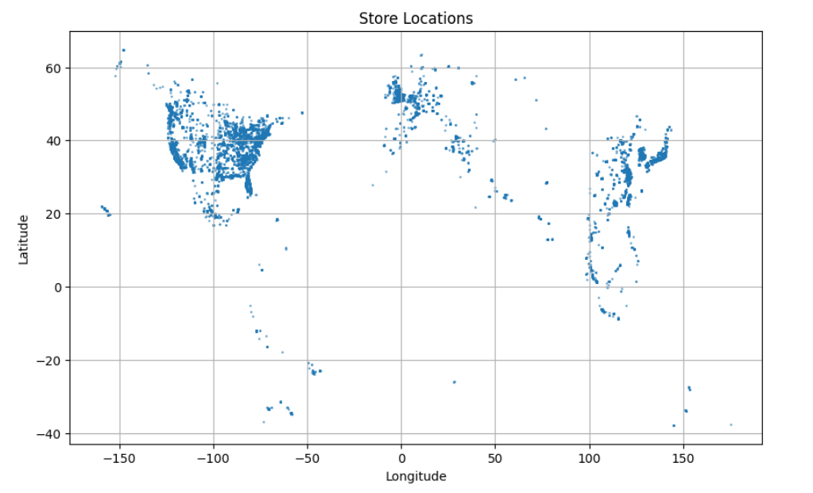
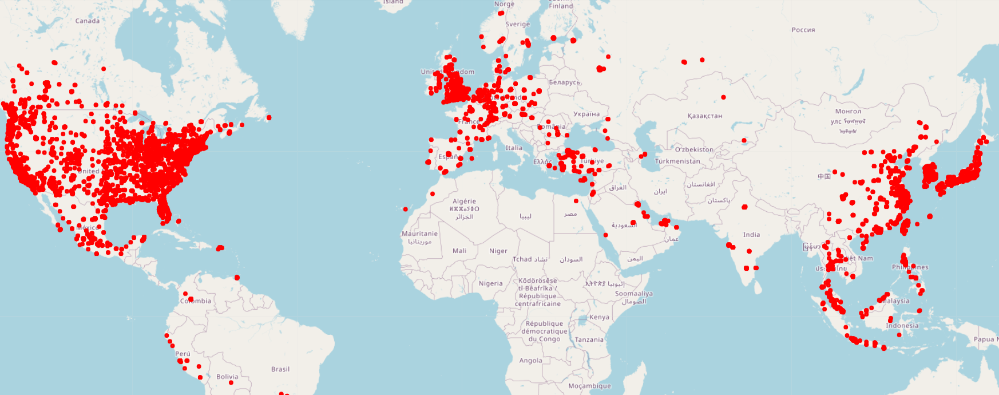
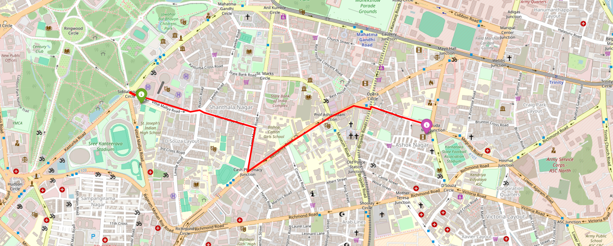
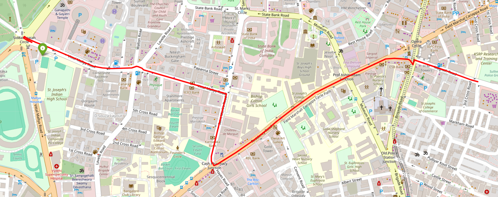

STARBUCKS PATHFINDER (PySpark + OSMnx + Routing)
================================================
Repository: starbuck-pathfinder
Tagline: pyspark-osmnx-routing

What this is
------------
A Google Colab–ready project that uses PySpark for scalable data handling and
OSMnx (OpenStreetMap) for building road graphs and computing shortest paths
between latitude/longitude points. 

Why Colab
---------
This repo is designed to run end-to-end in Google Colab, so you don't have to
set up Spark locally. You can install Java + PySpark + OSMnx inside the notebook
and start routing immediately.

Repo Structure
--------------
starbuck-pathfinder.ipynb       - Main Colab notebook (PySpark + OSMnx shortest-path demo)
directory.csv        		- Dataset (CSV)
README.txt           		- This file

Quickstart (Google Colab)
-------------------------
1) Open Colab and open the notebook (.ipynb)
   - Go to: https://colab.research.google.com/github/<your-username>/starbuck-pathfinder/blob/main/a-spark.ipynb
   - Or in Colab: File → Open notebook → GitHub tab → paste your repo URL.

2) Put the dataset in Google Drive and mount it (or link it)
   **Option A — Mount Drive (recommended)**
   ```python
   from google.colab import drive
   drive.mount('/content/drive')  # authorize
   DATA_DIR = '/content/drive/MyDrive/path/to/your/data'  # where directory.csv lives
   CSV_PATH = f'{DATA_DIR}/directory.csv'
   ```
3) Install dependencies in the first cell (Java 11, PySpark 3.5.1, OSMnx)
   ```python
   !apt-get -qq install -y openjdk-11-jdk
   !pip -q install pyspark==3.5.1 osmnx matplotlib pandas
   import os
   os.environ["JAVA_HOME"] = "/usr/lib/jvm/java-11-openjdk-amd64"
   ```

Data Notes
----------
- directory.csv includes columns like: Store Number, Store Name, City, Country,
  Longitude, Latitude, Ownership Type, Timezone, etc.
- Some fields (e.g., Phone Number, Postcode) may be missing in places.
- Coordinates are in WGS84 (lat/lon).

Known Gotchas (Colab)
---------------------
- Colab VMs are ephemeral; files are lost when the session ends. Commit changes
  back to GitHub or mount Google Drive (from the Colab "Files" pane).
- OSMnx downloads data from OpenStreetMap; very large bounding boxes can be slow
  or hit rate limits. Start with modest areas and scale up.
- No GPU is necessary for this project.

License
-------
MIT License (see LICENSE if included).


Credits & Data Sources
----------------------
- OpenStreetMap contributors (via OSMnx)
- Kaggle — Starbucks store locations dataset
- Starbucks store directory dataset (directory.csv)
- PySpark, NetworkX, Matplotlib

Screenshots
-----------




